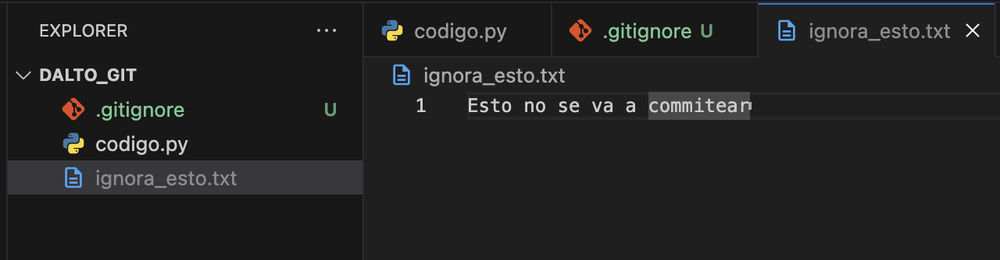
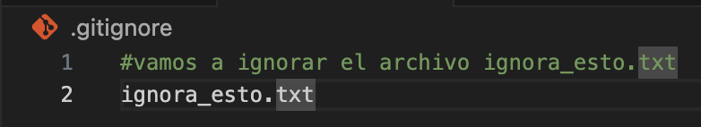
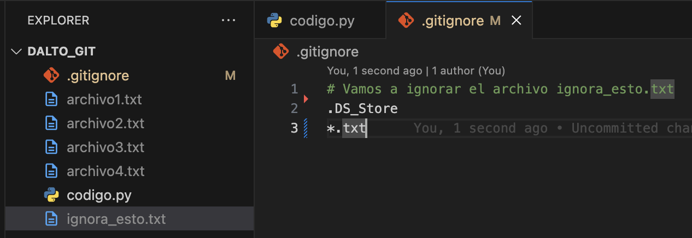
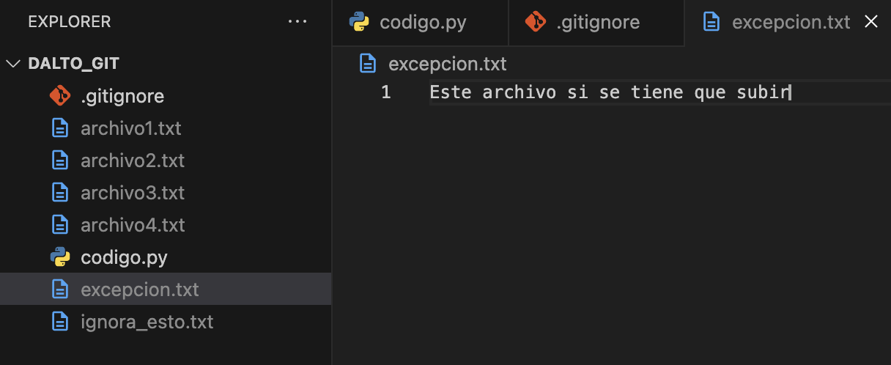
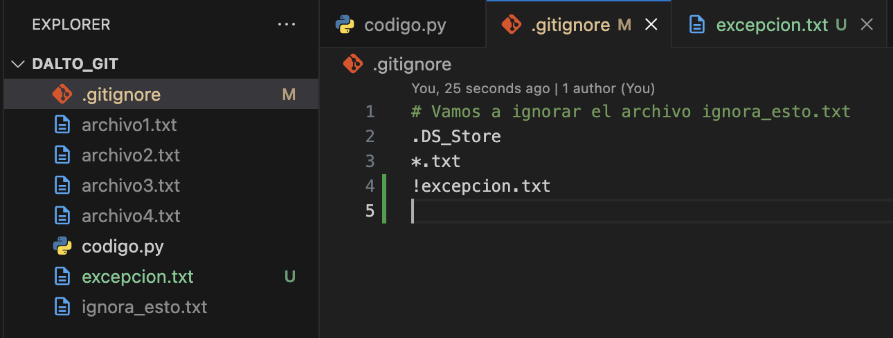

# Creando archivo `.gitignore`

1. Desde la terminal

    ```zsh
    jimmyrampage $ touch .gitignore
    ```

2. Lo abrimos

    

3. agregamos un archivo para ignorarlo

    
    

4. Hacemos commit y revisamos

    ```zsh
    jimmyrampage $ git add.
    jimmyrampage $ git commit -m "ignorando archivo"
    [main a6653] ignorando archivo
     1 file changed, 3 insertions (+) create mode 100644 •gitignore
    jimmyrampage $ git ls-tree -r --name-only HEAD
    .gitignore
    código.py
    ```

## Ignorando multiples archivos

Para ignorar multiples archivos de un mismo tipo escribimos

```plaintext
*.extension
```

Ejemplo:

```plaintext
*.txt # Ignorara todos los archivos txt
*.jpg # Ignorara todas las fotografías
```



```zsh
jimmyrampage $ touch archivo1.txt archivo2.txt archivo3.txt archivo4.txt
jimmyrampage $ git add .
jimmyrampage $ git commit -m "ignorando archivos de texto"
[main b93bf] ignorando archivos de texto
 1 file changed, 1 insertion(+), 1 deletion (-)
jimmyrampage $ git ls-tree --name-only HEAD
.gitignore
código.py
```

### Haciendo una excepción



Para no ignorar un archivo escribimos:

```plaintext
!<file>
```



```zsh
jimmyrampage $ touch excepción.txt
jimmyrampage $ git add
jimmyrampage $ git commit -m "ignorando archivos de texto menos uno"
[main 2c790] ignorando archivos de texto menos uno
 2 files changed, 3 insertions(+), 1 deletion (-)
 create mode 100644 excepción.txt
jimmyrampage $ git 1s-tree --name-only HEAD
.gitignore
código.py
excepción.txt
```

Para ignorar archivos que tengan un texto común:

```plaintext
*<texto en común>.txt
*).txt
```
