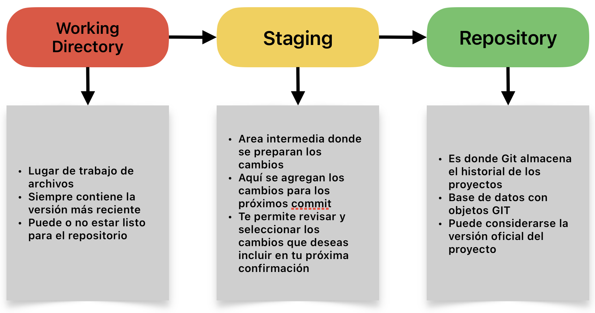

# Primeros pasos en GIT

## Que es un repositorio

Es un lugar donde se almacena y gestionan los archivos de un proyecto, junto con su historial de cambios.
En principio, es una base de datos que almacena los archivos de un proyecto, así como toda la información relacionada con su historial de cambios, quién realizó esos cambios y cuándo se hicieron.

>No confundir con el directorio de trabajo

## Conceptos principales

En Git, hay tres conceptos principales que interactúan entre sí:

1. **Directorio de Trabajo (Working Directory)**:
    * Este es el directorio en tu sistema de archivos donde trabajas con tus archivos del proyecto.
    * Aquí es donde creas, modificas y eliminas archivos.
    * El directorio de trabajo contiene la versión más reciente de tus archivos.
    * Los cambios en el directorio de trabajo pueden o no estar preparados para ser confirmados en el repositorio.

2. **Área de Preparación (Staging Area o Index)**:
    * Es una especie de área intermedia donde se preparan los cambios antes de confirmarlos en el repositorio.
    * Aquí agregas los cambios que deseas incluir en tu próxima confirmación (commit).
    * Los cambios en el área de preparación aún no están guardados en el repositorio, pero están preparados para ser confirmados.
    * Te permite revisar y seleccionar los cambios que deseas incluir en tu próxima confirmación.

3. **Repositorio (Repository)**:
    * Es donde Git almacena el historial completo de tu proyecto, incluyendo todos los cambios realizados en los archivos.
    * Consiste en una base de datos que contiene objetos Git (versiones de archivos), referencias a esos objetos (ramas, etiquetas, etc.) y metadatos (autor, fecha, mensaje de confirmación, etc.).
    * Los cambios confirmados (commits) se guardan de manera permanente en el repositorio.
    * Puedes considerarlo como la "versión oficial" de tu proyecto.

## Cómo se relacionan

* Los cambios comienzan en el Directorio de Trabajo. Estos se visualizan con `git status`
* Luego, los cambios que deseas incluir en tu próxima confirmación se agregan al Área de Preparación utilizando el comando `git add`.
* Una vez que has preparado todos los cambios que deseas confirmar, realizas una confirmación (commit) con el comando `git commit`, que toma los cambios del Área de Preparación y los guarda de manera permanente en el Repositorio, junto con un mensaje descriptivo.
* El ciclo se repite: realizas cambios en el Directorio de Trabajo, los agregas al Área de Preparación y los confirmas en el Repositorio.

En resumen, el Directorio de Trabajo es donde trabajas con tus archivos, el Área de Preparación es donde preparas los cambios para ser confirmados, y el Repositorio es donde se almacenan permanentemente las versiones confirmadas de tus archivos.

>Comandos útiles para utilizar en la terminal
>
>[Git Cheat Sheet | Geeks4Geeks](https://www.geeksforgeeks.org/git-cheat-sheet/)
