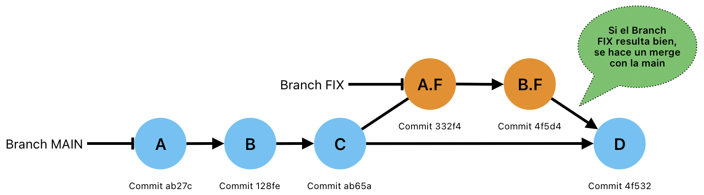

# Branches (ramas)

Las ramas en Git son diferentes líneas de desarrollo en un proyecto. Te permiten trabajar en características nuevas o correcciones la de errores sin afectar directamente al código principal. Por ejemplo, podrías tener una rama para una nueva funcionalidad y otra para correcciones de errores de una funcionalidad ya existente. Las ramas facilitan la colaboración y la organización del trabajo en equipo.



> Branch main: Es la rama del proyecto estable.
>
> Branch fix: Es una rama que sirve para reparar x funcionalidad, sin afectar a la rama main. Una vez te termina el uso de esta rama, se fusiona (merge) con la rama main.

## Creando nueva rama

* Para crear una rama nueva se utiliza:

  ```zsh
  git branch <new-branch-kebab-case>
  ```

  >[!IMPORTANT]
  >Utilizamos kebab-case para escribir el nombre de nuestras ramas.

  ```zsh
  jimmyrampage $ git branch modificar-dev
  ```

* Para ver nuestras ramas existentes se usa el comando `git branch` Esto nos muestra todas las ramas que existen y también nos señala en cual rama estamos situados.

  ```zsh
  git branch
  ```

  ```zsh
  jimmyrampage $ git branch
  * main
    modificar-dev
  ```

## Cambiando entre ramas

* Opción 1:

  ```zsh
  git checkout <branch-name>
  ```

  ```zsh
  jimmyrampage $ git checkout modificar-dev
  Switched to branch 'modificar-dev'
  jimmyrampage $ git branch
    main
  * modificar-dev
  ```

* Opción 2: (**Recomendado**)

  ```zsh
  git switch <branch-name>
  ```

  ```zsh
  jimmyrampage $ git switch main Switched to branch 'main'
  jimmyrampage $ git branch
  * main
    modificar-dev
  ```

  >[!NOTE]
  >Este comando es más especifico y se agrego en la version 2.23 de git, con el objetivo de separar las diferentes funcionalidades que tiene `git checkout`.

## Creando una rama y posicionarnos en ella directamente

* Opción 1:

  ```zsh
  git checkout -b <new-branch-name>
  ```

  ```zsh
  jimmyrampage $ git checkout -b rama-checkout
  Switched to a new branch ' rama-checkout'
  jimmyrampage $ git branch
    main
    modificar-dev
  * rama-checkout
  ```

* Opción 2: (**Recomendado**)

  ```zsh
  git switch -c <new-branch-name>
  ```

  ```zsh
  jimmyrampage $ git switch -c rama-switch
  Switched to a new branch 'rama-switch'
  jimmyrampage $ git branch
    main
    modificar-dev rama-checkout
  * rama-switch
  ```

  >[!NOTE]
  >La recomendación es la misma que la anterior, evitar confusiones de los usuarios ya que `git checkout` tiene más alcances.

## Eliminando una rama

```zsh
git branch -d <branch-name>
```

```zsh
jimmyrampage $ git switch main
Switched to branch 'main'
jimmyrampage $ git branch -d rama-checkout
Deleted branch rama-checkout (was 18ef7).
jimmyrampage $ git branch
* main
  modificar-dev rama-switch
```

>[!NOTE]
>Para utilizar este comando es importante no estar situado en la rama a eliminar.

## Modificar el nombre de una rama

* Opción 1: Modificando una rama distinta a la que estoy situado

  ```zsh
  git branch -m <branch-name> <new-branch-name>
  ```

  ```zsh
  jimmyrampage $ git branch -m modificar-dev modificar-txt
  jimmyrampage $ git branch
  * main
    modificar-txt
  ```

* Opción 2: Modificando el nombre de la rama en la que estoy

  ```zsh
  git branch -m <new-branch-name>
  ```

  ```zsh
  jimmyrampage $ git branch
  * main
    modificar-txt
  jimmyrampage $ git switch modificar-txt
  Switched to branch 'modificar-txt'
  jimmyrampage $ git branch -m mod-txt
  jimmyrampage $ git branch
    main
  * mod- txt
  ```
