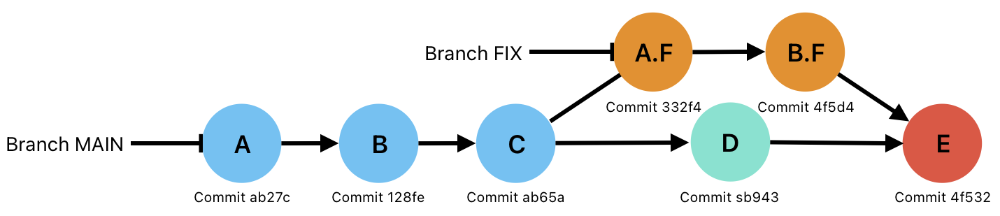
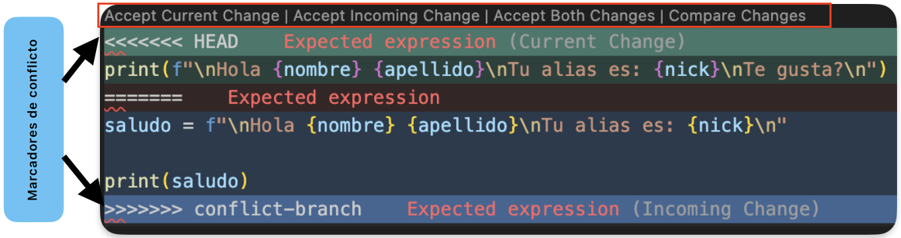
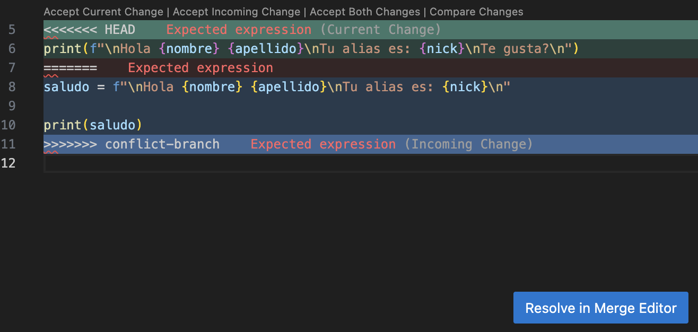
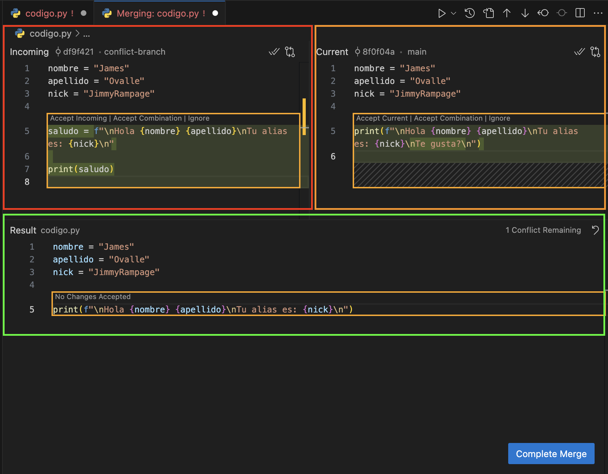

# Merge conflicts

Los conflictos pueden producirse cuando fusionamos ramas que han tenido cambios después de la creación de la rama hija.
La branch FIX fue creada desde el commit “C” en main
Luego en la rama MAIN se hizo el commit “D” antes de fusionar la rama FIX
Al fusionar, como “C” cambio a “D”, crean un conflicto.


## Practica

### Creamos un nuevo proyecto

1. Creamos el repositorio y un archivo .py

    ```zsh
    jimmyrampage $ git init
    Initialized empty Git repository in /Users/jimmyrampage/Code/Dalto_Git/.git/
    jimmyrampage $ touch código.py
    jimmyrampage $ code .
    ```

2. Creamos un código en VSCode

    ```py
    nombre = "James"
    apellido = "Ovalle"
    nick = "JimmyRampage"
    print(f"\nHola {nombre} {apellido}\nTu alias es: {nick}\n")
    ```

3. Hacemos commit

    ```zsh
    jimmyrampage $ git status -s
    ?? código.py
    jimmyrampage $ git add código.py
    jimmyrampage $ git commit -m "Creando saludo" -a
    [main (root-commit) 6ce88] Creando saludo
     1 file changed, 5 insertions (+)
     create mode 100644 código.py
    jimmyrampage $ git log --oneline
    6ce88 (HEAD -> main) Creando saludo
    ```

4. Creamos una nueva rama y nos situamos en ella

    ```zsh
    jimmyrampage $ git switch -c conflict-branch
    Switched to a new branch 'conflict-branch'
    ```

5. Modificamos el código en la nueva rama y hacemos commit

    ```py
    nombre = "James"
    apellido = "Ovalle"
    nick = "JimmyRampage"
    saludo = f"\nHola {nombre} {apellido}\nTu alias es: {nick}\n"
    print (saludo)
    ```

    ```zsh
    jimmyrampage $ git status -s
    M código.py
    jimmyrampage $ git add código.py
    jimmyrampage $ git commit -m "optimizando el saludo"
    [conflict-branch df9f4] optimizando el saludo
     1 file changed, 3 insertions(+), 1 deletion (-)
    ```

6. Volvemos a la rama main, modificamos el código y hacemos commit (con el objetivo de hacer un conflicto)

    ```zsh
    jimmyrampage $ git switch main
    Switched to branch 'main'
    ```

    ```py
    nombre = "James"
    apellido = "Ovalle"
    nick = "JimmyRampage"
    print(f"\nHola {nombre} {apellido}\nTu alias es: {nick}\nTe gusta?\n")
    ```

    ```zsh
    jimmyrampage $ git status -s
    M código.py
    Jimmyrampage $ git add código.py
    jimmyrampage $ git commit -m "agregando texto al saludo"
    [main 8f0f0] agregando texto al saludo
     1 file changed, 1 insertion(+), 1 deletion (-)
    jimmyrampage $ git log --oneline --all
    8f0f0 (HEAD -> main) agregando texto al saludo
    df9f4 (conflict-branch) optimizando el saludo
    6ce88 Creando saludo
    ```

7. Vemos todos los commits del proyecto con

    ```zsh
    git log --oneline --all
    ```

### Hacemos merge

>[!IMPORTANT]
>Recordar que para hacer merge nos situamos en la rama padre o la que queremos que adopte los cambios. En este caso, “”main”

```zsh
jimmyrampage $ git merge conflict-branch
Auto-merging código.py
CONFLICT (content): Merge conflict in código.py
Automatic merge failed; fix conflicts and then commit the result.
```

### Aparecen los conflictos



* Lo marcado en HEAD (verde) es lo que esta en mi rama main
* Lo marcado en azul es lo que quiero fusionar
* En el recuadro marcado en rojo, tiene 4 opciones (sus nombres ya son bastante descriptivos)



También nos aparece el botón “Resolve in Merge Editor”
Al utilizar el Merge Editor abrirá algo como esto:



* El recuadro rojo señala los cambios que vienen de “conflict-branch”
* El recuadro naranjo los existente en “main”
* El recuadro verde el resultado

>La resolución del conflicto depende de las necesidades del proyecto

Una vez resulto el conflicto, clic en Complete Merge y luego en Commit.
También puede ser en Complete Merge y luego en la terminal:

```zsh
git merge --continue
```

```zsh
19201 (HEAD -> main) Merge branch 'conflict-branch'
8f0f0 agregando texto al saludo
df9f4 (conflict-branch) optimizando el saludo
6ce88 Creando saludo
```
