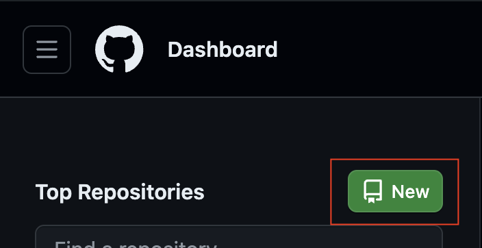
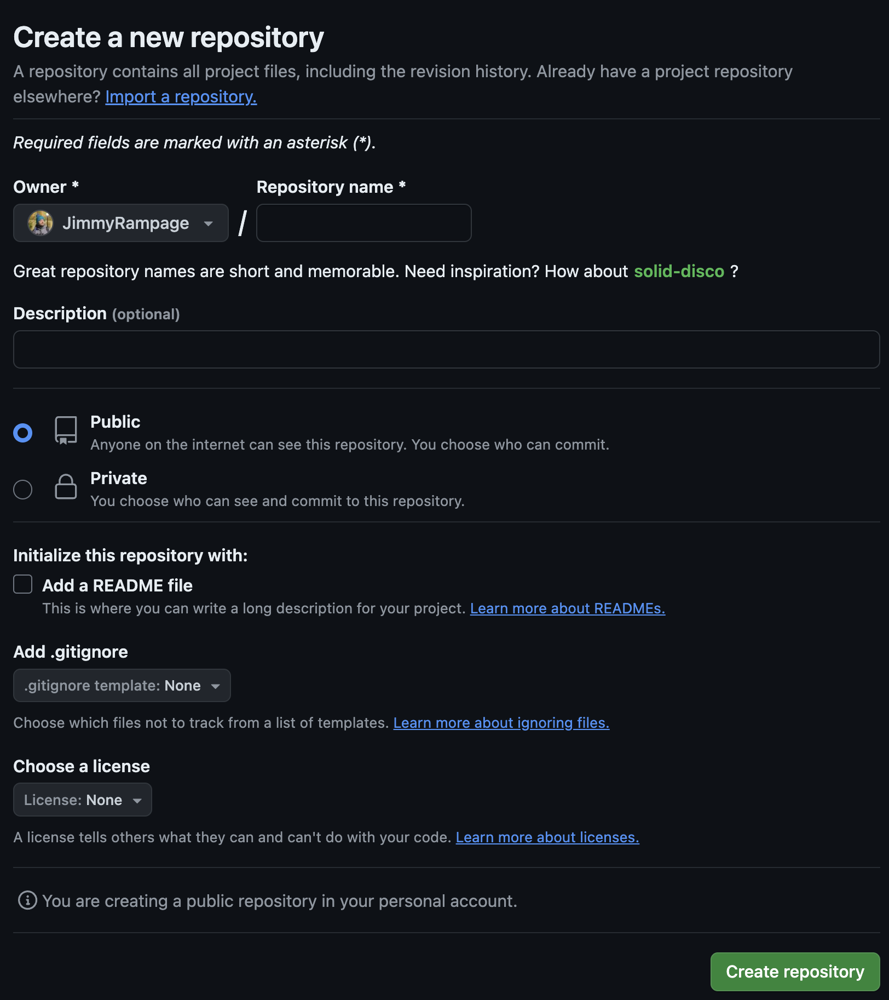
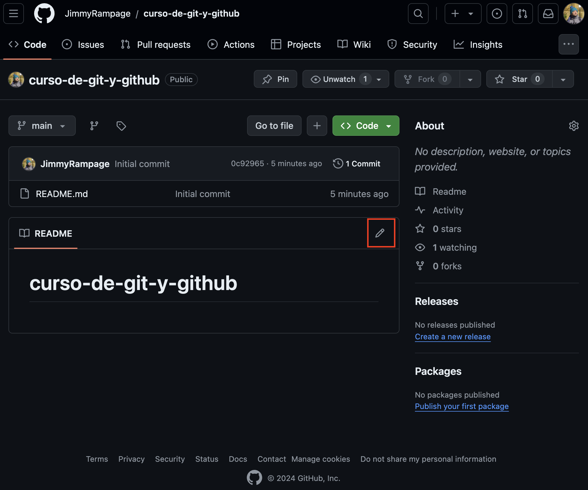
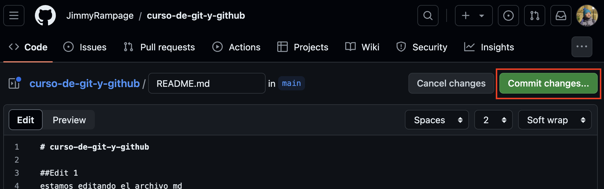
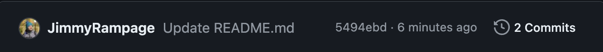
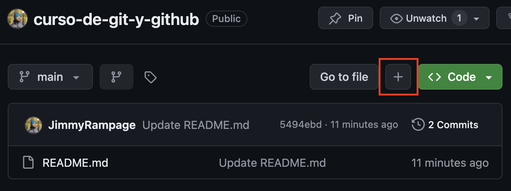
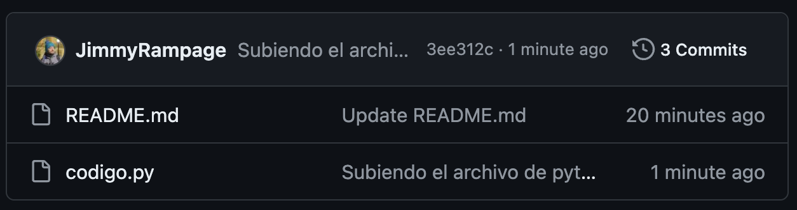

# Que es un repositorio

Un repositorio en GitHub es un espacio de almacenamiento centralizado donde se guarda, organiza, mantiene y controla versiones de un proyecto. Puede contener archivos de código, imágenes, audios, o cualquier otro tipo de archivo que el proyecto necesite.

Cada repositorio en GitHub es accesible a través de una URL única y contiene todo lo necesario para el proyecto, incluyendo:

* **Código fuente**: Los archivos de código que componen el proyecto.
* **Documentación**: Instrucciones, manuales, información sobre licencias, etc.
* **Control de versiones**: Un historial de cambios que permite rastrear y revertir modificaciones si es necesario.
* **Issues**: Un sistema de seguimiento de problemas que permite a los usuarios reportar errores, solicitar características, etc.
* **Pull Requests**: Propuestas de cambios que otros desarrolladores pueden revisar y fusionar en el proyecto.

Además, los repositorios pueden ser **públicos** (accesibles a todos en internet) o **privados** (solo accesibles para ciertos usuarios).

## Creando un repositorio

### Desde home podemos crear un repositorio

### Se abrirá un formulario

* **Repository name**: se escribe con kebab-case y tiene que ser descriptivo al proyecto
* **Public**: Cualquiera con acceso a internet puede ver el repositorio.
* **Private**: Solo quien tenga permisos podrá acceder al repositorio.
* **Readme**: es el archivo que describe el repositorio y el proyecto de manera descriptiva, este es un archivo Markdown (.md).
* **Gitignore**: Archivo que ignorara los archivos y carpetas que nosotros le escribamos.
* **License**: Existen diversos tipos de licencias para nuestros proyectos.
* **Create Repository**: Una vez que rellenamos el formulario podemos crear el repositorio.

>Eso es lo que veremos si es que creamos el archivo readme.md

### Abrimos readme.md para modificarlo

### Clic en commit changes

y se abrirá la siguiente ventana

Es como hacer un commit en la terminal, solo que con una interfaz gráfica de github

### Segundo commit

Ahora dice que tenemos dos commits, porque el primero fue la creación y el segundo el edit que hicimos recién

## Creando o subiendo archivos

Si hacemos clic sobre el icono de `+` nos abrirá una ventana

> En esta ventana podemos arrastrar archivos que queramos subir o crearlos.

Y podemos hacer commit sobre los cambios

