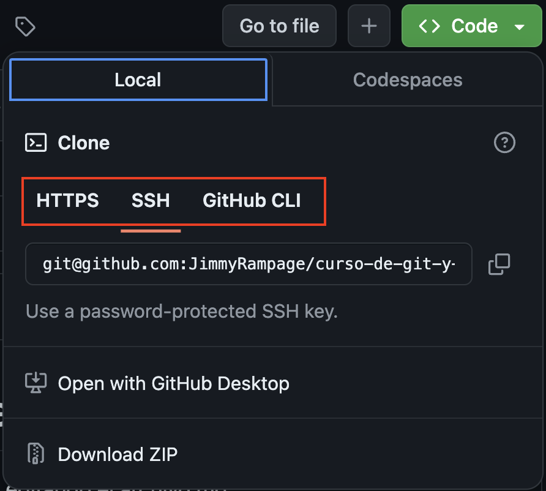
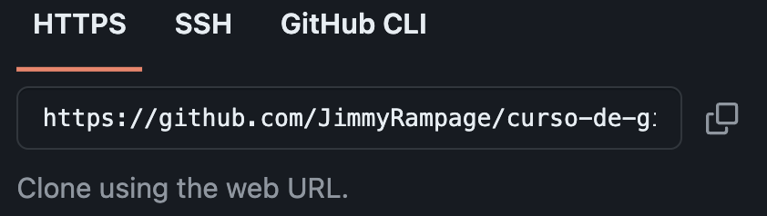
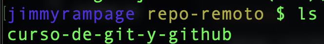

# Git clone

Es un comando de Git que se utiliza para crear una copia de un repositorio existente en una nueva ubicación. Este comando descarga todos los archivos, el historial de commits, y las ramas del repositorio original y los guarda en tu máquina local.

## Clonando un repositorio

### Métodos de clonado

Para clonar un repositorio click sobre code, y tenemos 3 opciones para hacerlo, HTTPS, SSH, GitHub CLI.

La diferencia entre clonar un repositorio Git utilizando HTTPS, SSH, y GitHub CLI radica en la forma de autenticación y en el método de acceso al repositorio.

#### HTTPS

* **Facilidad**: Fácil de usar sin configuración inicial.
* **Seguridad**: Menos seguro sin tokens; requiere autenticación frecuente.
* **Acceso**: Ideal para clonar repositorios públicos rápidamente.

#### SSH

* **Facilidad**: Requiere configuración inicial de claves SSH.
* **Seguridad**: Alta seguridad con claves SSH; autenticación automática.
* **Acceso**: Mejor para usuarios frecuentes que necesitan acceso seguro y sin interrupciones.

#### GitHub CLI

* **Facilidad**: Proporciona flujo de autenticación simplificado y herramientas adicionales.
* **Seguridad**: Usa tokens de acceso almacenados de forma segura.
* **Acceso**: Ideal para usuarios que quieren gestionar múltiples aspectos del repositorio desde la línea de comandos.

### Clonando mediante HTTPS

Seleccionamos HTTPS, copiamos la url y la pegamos junto con el comando `git clone <url>` en la terminal.

Comprobamos con `ls`

Entramos el repo con `cd`

