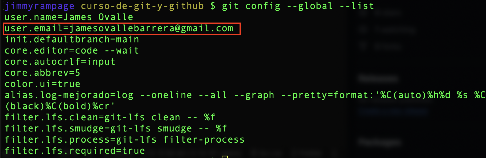
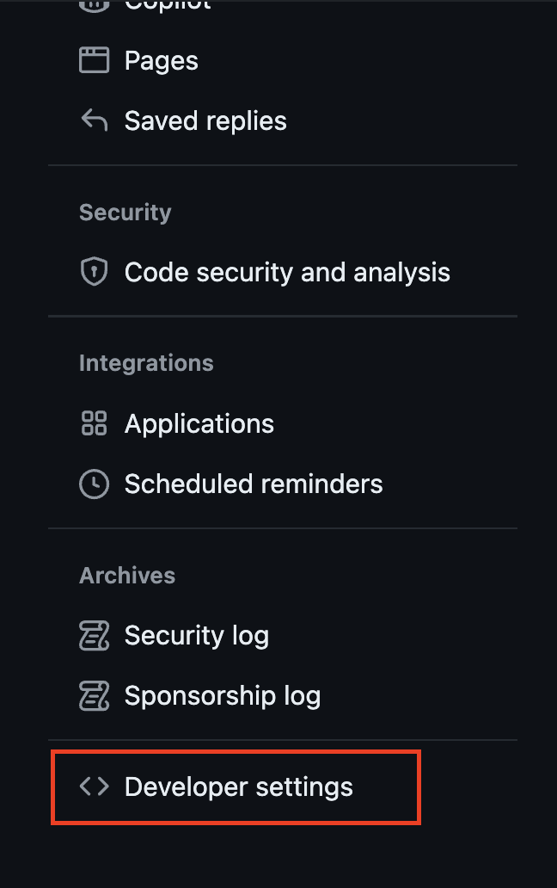
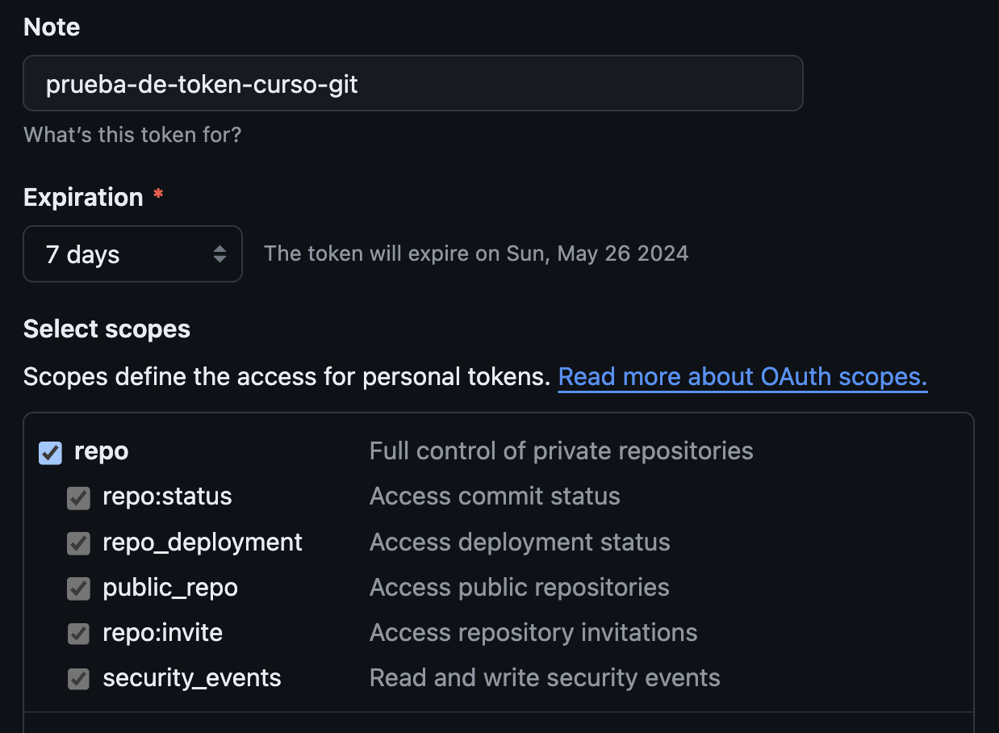

# Git push

Es un comando de Git que se utiliza para enviar los commits locales a un repositorio remoto. Este comando actualiza la rama remota con los cambios realizados en la rama local. Es esencial para colaborar en proyectos con otros desarrolladores, ya que permite compartir el trabajo y actualizar el repositorio remoto con las últimas modificaciones.

## Haciendo push

Abrimos el proyecto clonado y modificamos el código.py y lo guardamos.

vemos `git status`

Utilizamos `git add <file>` y `git commit -m ""`

### Subiendo al servidor

Revisamos las configuraciones.

>El correo configurado debe ser el mismo que de la cuenta de github.

### `git push origin main`

* origin hace referencia a que quiero realizar un push al repositorio de origen.
* main hace referencia a la rama que estoy subiendo un cambio.

>Nos solicitara información adicional.
>
>Esto por haber utilizado sistema de HTTPS
>
>El user name: en mi caso es JimmyRampage
>
>El password es un token de seguridad, no es el password de inicio de sesión.

## Para obtener el token

1. Vamos a settings

    

2. Bajamos hasta <> Developer settings

    

3. Vamos a personal access tokens -> tokens (classic)

    

4. Generamos un token personal

    

5. Pasamos esta capa de seguridad

    

6. Configuración del token
    * Definimos detalles como una referencia a que es el token
    * Definimos cuando expira el token, (mientras menos días es más seguro)
    * Y también permisos para el token

    

7. Generamos el token

    

    

8. Copiamos y pegamos el token en la terminal

    

9. Confirmamos el cambio en github (el tiempo de 24minutes ago | se debe a que el commit fue hecho en mi computadora hace 24 minutos)

    

    
