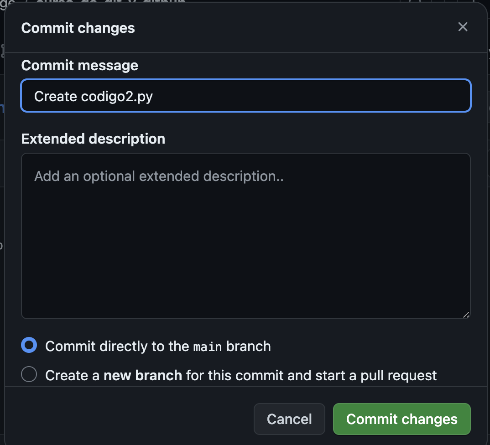

# Git pull & Git fetch

* `git pull` es un comando de Git que se utiliza para actualizar tu repositorio local con los cambios de un repositorio remoto. Este comando combina dos operaciones: git fetch (para descargar los datos del remoto) y git merge (para fusionar esos datos en tu rama actual).

* `git fetch` es un comando de Git que se utiliza para descargar los datos (commits, archivos y referencias) de un repositorio remoto sin fusionarlos automáticamente en tu rama actual. Este comando actualiza tu vista de las ramas remotas en tu repositorio local, permitiéndote ver los cambios antes de fusionarlos.

## Creamos un código en el repositorio desde GitHub

### Hacemos commit changes

### Utilizamos git pull para actualizar todo

## Git fetch

>No cambia las ramas locales automáticamente

### Hacemos cambios en github, eliminamos codigo2.py y hacemos commit

### Ahora editamos codigo.py

