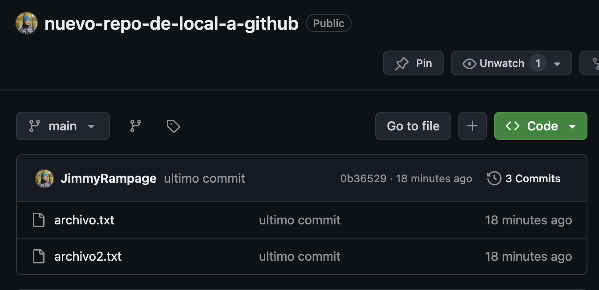

# Migrar repositorio local

>Vamos a crear un repositorio local nuestro

>Vamos a crear u segundo commit con otros archivos

>Creamos un 3er commit

>Revisamos los commits

## Integrándolo a GitHub

vamos a github y creamos un nuevo repositorio

>[!IMPORTANT]
>importante no crear readme.md

>Nos saldrá esta ventana

>Copiamos las lineas del recuadro rojo y las pegamos en la terminal

>Con `git remote -v` podemos ver las cosas que podemos hacer con el repositorio remoto, opciones que da el host (github)

