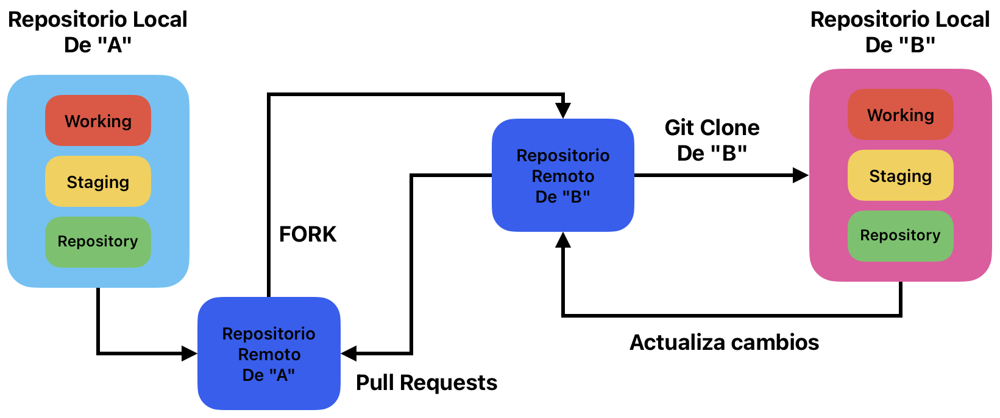

# Pull Requests

## ¿Qué es un Pull Request?

* Un Pull Request (PR) es una característica de plataformas de control de versiones como GitHub, GitLab y Bitbucket, que permite a los desarrolladores notificar a los mantenedores de un repositorio sobre cambios que han realizado en una rama de su repositorio. Un pull request sugiere que los cambios en una rama sean "tirados" (merged) en otra rama del repositorio principal.

## ¿Cuándo Usar un Pull Request?

* Contribuir a Proyectos de Código Abierto
  * Si deseas contribuir a un proyecto de código abierto, primero haces un fork del repositorio, creas una rama para tus cambios, y luego envías un pull request al repositorio original. Esto notifica a los mantenedores del proyecto que has realizado cambios que te gustaría que fueran integrados.

* Colaboración en Equipos
  * Dentro de equipos de desarrollo, los pull requests se utilizan para revisar el código antes de fusionarlo con la rama principal (como main o develop). Este proceso de revisión ayuda a detectar errores, mejorar la calidad del código y mantener la coherencia del estilo de codificación.

* Revisión de Código
  * Los pull requests facilitan la revisión de código, permitiendo que otros miembros del equipo comenten sobre líneas específicas del código, sugieran cambios y aprueben los cambios propuestos.

* Gestión de Características
  * Cada nueva característica o corrección de errores puede desarrollarse en su propia rama. Una vez completada, se envía un pull request para fusionar esa rama con la rama principal. Esto facilita la gestión de nuevas características y su integración ordenada en el código base.

