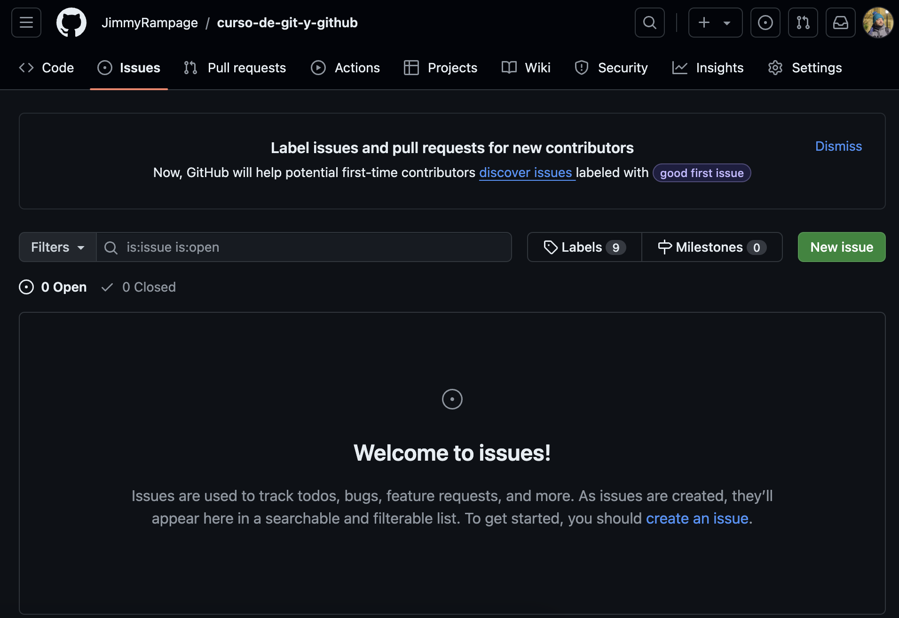
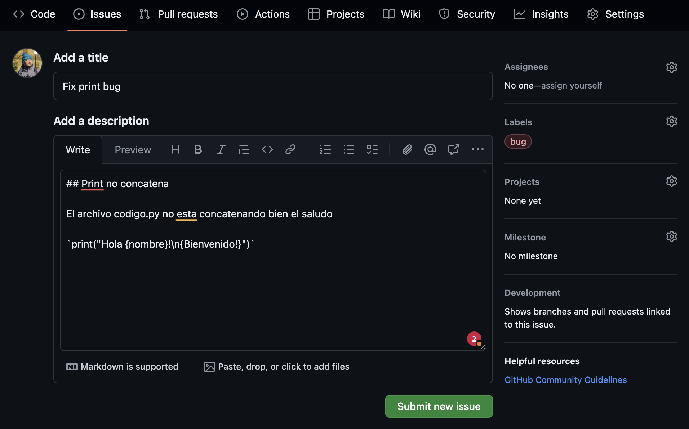
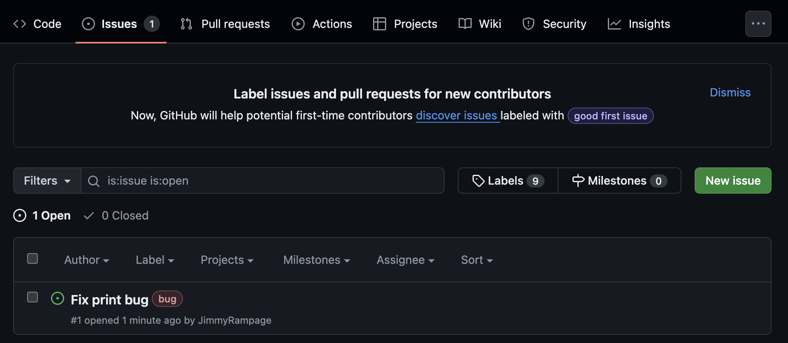
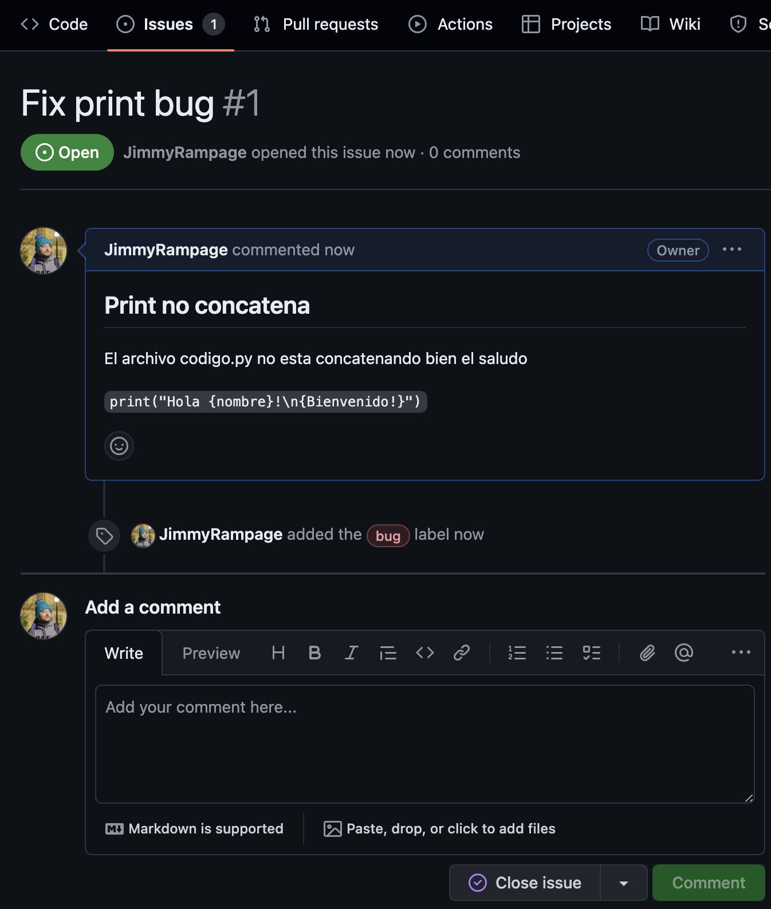
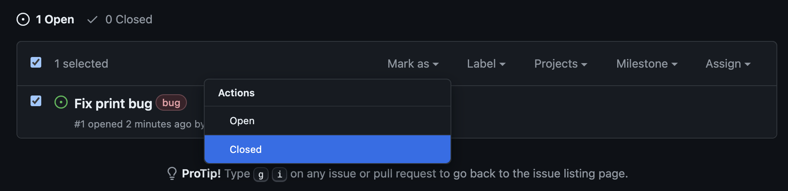

# GitHub Issues

En GitHub, los "issues" (problemas o incidencias) son una herramienta esencial para el seguimiento de tareas, errores, solicitudes de características y discusiones en un proyecto de desarrollo de software. Aquí tienes un desglose de qué son y cómo se utilizan:

## ¿Qué son los Issues en GitHub?

Definición:

* Los issues son elementos que permiten a los colaboradores de un proyecto discutir e informar sobre tareas, mejoras, errores o cualquier tipo de problema relacionado con el proyecto.
* Funcionan como un sistema de seguimiento de problemas donde los miembros del equipo y la comunidad pueden colaborar.

## Componentes de un Issue

* Título: Un resumen breve y claro del problema o tarea.
* Descripción: Detalles sobre el problema, tarea o solicitud. Puede incluir pasos para reproducir un error, propuestas de solución, capturas de pantalla, y cualquier información relevante.
* Comentarios: Espacio para que los colaboradores discutan sobre el issue, ofrezcan soluciones, pidan aclaraciones, etc.
* Etiquetas (Labels): Categorías que ayudan a organizar y priorizar los issues (por ejemplo, bug, enhancement, documentation).
* Asignados (Assignees): Personas responsables de resolver el issue.
* Proyectos: Vinculación con proyectos específicos dentro de GitHub para una mejor gestión.
* Milestones: Metas o hitos para agrupar issues que deben completarse en un cierto periodo de tiempo.
* Estado: Abierto (Open) o Cerrado (Closed), indicando si el issue está siendo trabajado o ya se ha resuelto.

## Uso Común

* Reportar Errores (Bugs): Descripción de problemas encontrados en el software.
* Solicitar Nuevas Funcionalidades (Feature Requests): Propuestas para añadir nuevas características o mejoras.
* Preguntas y Discusiones: Plantear dudas y fomentar discusiones sobre el uso o desarrollo del proyecto.
* Tareas y Tareas Pendientes (To-Dos): Listar y hacer seguimiento de las tareas pendientes.

## Ventajas de Usar Issues en GitHub

* Colaboración: Facilitan la colaboración entre desarrolladores y usuarios, permitiendo una comunicación clara y organizada.
* Transparencia: Todos los interesados pueden ver el estado y progreso de los issues, fomentando la transparencia en el desarrollo.
* Historial y Documentación: Los issues proporcionan un historial de problemas y discusiones que pueden ser útiles para referencia futura.
* Integración: Los issues se integran bien con otras herramientas de GitHub, como los repositorios, las pull requests y los proyectos.

## Cómo Crear un Issue

1. Navega al Repositorio: Ve al repositorio de GitHub donde quieres crear el issue.
2. Ir a la Sección de Issues: Haz clic en la pestaña "Issues" en la parte superior.
3. Nuevo Issue: Haz clic en el botón "New issue".
4. Completa los Detalles: Rellena el título y la descripción del issue. Puedes agregar etiquetas, asignados, proyectos y milestones si es necesario.
5. Enviar: Haz clic en "Submit new issue" para crear el issue.

>En resumen, los issues en GitHub son una herramienta poderosa para la gestión de proyectos de software, permitiendo a los equipos colaborar de manera eficiente en la identificación y resolución de problemas, así como en la implementación de nuevas características.

